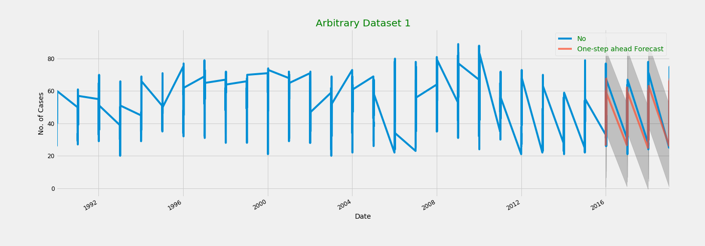
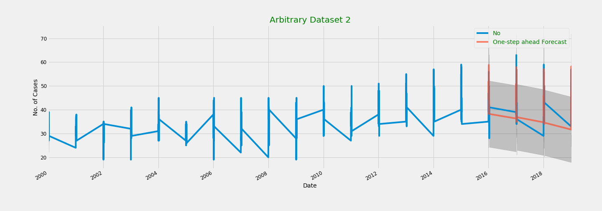

# One year forecast of 'Number of Cases' in two arbitrary departments

Due to unavailability of a suitable dataset to forecast the number of bribery cases reported in a particular department/area, and as per the BPRD official's allowance to work on dummy data if needed, a dataset was created ("monthly_data1.csv") by our team with certain subtle assumptions (like increased number of cases during September, October due to Puja and Diwali; March (year-end) etc) and also with slight consideration of a google form circulated among our college-mates.

The second dataset ("monthly_data2.csv") was created to show that the **same** model (with different sets of hyperparameters obviously) fit fairly well.

### Data Type: Time Series
### Model used: Seasonal Autoregressive Integrated Moving Average (SARIMA)
##### Hyperparameters (p,d,q) and (P,Q,D) chosen automatically by the code by choosing the one with minimum AIC score [m=12 for monthly data suggests a yearly seasonal cycle]

